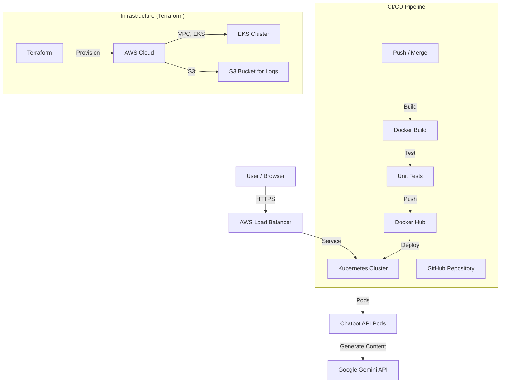

# 🤖 Gemini AI Chatbot with DevOps Automation

A production-ready AI chatbot application integrated with a complete DevOps pipeline, featuring CI/CD automation, Docker containerization, Kubernetes deployment, and Terraform-based infrastructure management.

## 🚀 Key Features

- **FastAPI Backend**: High-performance Python web framework for the chatbot API.
- **Google Gemini Integration**: Powered by Google's latest AI models for natural language understanding and generation.
- **CI/CD Pipeline**: Automated testing, building, and deployment triggered by Git pushes.
- **Docker Containerization**: Encapsulates the application for consistent deployment across environments.
- **Kubernetes Orchestration**: Manages containerized applications with auto-scaling and service discovery.
- **Terraform IaC**: Infrastructure as Code for provisioning and managing AWS resources (VPC, EKS).
- **Notifications**: Real-time Slack notifications for pipeline status.

---

## 🏗️ Architecture



---

## 🛠️ Tech Stack

| Category | Tools |
|----------|-------|
| **Backend** | FastAPI, Uvicorn, Google GenAI |
| **Frontend** | HTML, CSS, Vanilla JavaScript |
| **Containerization** | Docker |
| **Orchestration** | Kubernetes |
| **IaC** | Terraform |
| **CI/CD** | GitHub Actions |
| **Cloud** | AWS |
| **Notifications** | Slack |

---

## 📂 Project Structure

```
chatbot-api/
├── static/                   # Frontend files
│   ├── index.html
│   ├── style.css
│   └── script.js
├── chatbot_ai/              # Backend application
│   ├── __init__.py
│   ├── main.py               # FastAPI application
│   ├── requirements.txt
│   └── .env.example
├── k8s/                      # Kubernetes manifests
│   ├── deployment.yaml
│   ├── service.yaml
│   └── secrets.yaml
├── terraform/                # Terraform configuration
│   ├── main.tf
│   ├── outputs.tf
│   ├── variables.tf
│   └── versions.tf
├── .github/workflows/       # CI/CD pipelines
│   └── deploy.yml
├── .env.example              # Environment variables template
├── .gitignore                # Git ignore rules
├── Dockerfile                # Docker build configuration
└── README.md                 # Project documentation
```

---

## 🚀 Getting Started

### Prerequisites

- **Docker**: Installed and running
- **Kubectl**: Installed
- **Terraform**: Installed (version 1.0+)
- **AWS Account**: Configured with appropriate permissions
- **GitHub Repository**: Your chatbot code hosted on GitHub
- **Slack Workspace**: For notifications

### 1. Configure Environment Variables

Copy the example environment file:
```bash
cp .env.example .env
```

Edit `.env` and add your API key:
```env
GOOGLE_API_KEY=your-google-api-key
```

### 2. Deploy Infrastructure with Terraform

Initialize Terraform:
```bash
cd terraform
terraform init
```

Plan and apply the infrastructure:
```bash
terraform plan
terraform apply
```

After applying, Terraform will output the EKS cluster information and Load Balancer URL.

### 3. Update Kubernetes Manifests

Set the Docker image name in the deployment:
```bash
# Replace 'your-docker-username' with your actual Docker Hub username
sed -i 's|DOCKER_USERNAME|your-docker-username|g' k8s/deployment.yaml
```

### 4. Apply Kubernetes Configuration

Apply the deployment and service manifests:
```bash
kubectl apply -f k8s/
```

### 5. Configure GitOps (Optional)

To enable the automated CI/CD pipeline, commit and push your changes to GitHub:
```bash
git add .
git commit -m "Initial commit"
git push origin master
```

The GitHub Actions workflow will automatically:
1. Run tests
2. Build the Docker image
3. Push to Docker Hub
4. Deploy to Kubernetes
5. Send Slack notification

---

## 🔧 CI/CD Pipeline Details

The `main.yml` workflow in `.github/workflows/` executes the following steps:

1. **Checkout**: Clones the repository
2. **Setup Python**: Configures Python environment
3. **Install Dependencies**: Installs Python packages
4. **Run Tests**: Executes unit tests
5. **Docker Build**: Builds and tags the Docker image
6. **Push Docker Image**: Pushes to Docker Hub
7. **Kubernetes Deployment**: Applies updated K8s manifests
8. **Slack Notification**: Notifies on success

**Required Secrets**: Make sure to add the following secrets to your GitHub repository:
- `DOCKER_USERNAME`
- `DOCKER_PASSWORD`
- `SLACK_WEBHOOK`

---

## ☁️ AWS Resources Created

Terraform creates the following AWS resources:

- **VPC**: Virtual Private Cloud with public and private subnets
- **EKS Cluster**: Managed Kubernetes cluster
- **Node Groups**: EC2 instances for running containers
- **S3 Bucket**: For storing logs and artifacts

---

## 💻 Usage

### Accessing the Chatbot

After deployment, you can access the chatbot through the Kubernetes Load Balancer:

```bash
# Get the Load Balancer URL
kubectl get svc chatbot-service
```

Open the URL in your browser and start chatting!

### Environment Variables

Create a `.env` file in the `chatbot_ai/` directory:

```env
GOOGLE_API_KEY=your-api-key
```

### Running Locally

```bash
cd chatbot_ai
pip install -r requirements.txt
uvicorn main:app --reload
```

Then access at `http://localhost:8000`

---

## 🧪 Testing

Run the unit tests:
```bash
pytest
```

---

## 🔄 Redeployment

### Redeploy Backend Only

```bash
cd chatbot_ai
uvicorn main:app --reload
```

### Redeploy to Kubernetes

```bash
cd chatbot_ai
docker build -t your-docker-username/chatbot-api:latest .
docker push your-docker-username/chatbot-api:latest
cd ..
kubectl apply -f k8s/
```

### Redeploy Infrastructure

```bash
cd terraform
terraform apply
```

---

## 📊 Monitoring & Observability

### Check Pod Logs

```bash
kubectl logs -f deployment/chatbot-deployment
```

### View Service Status

```bash
kubectl get svc chatbot-service
kubectl get pods
```

---

## 🗑️ Cleanup

### Remove Terraform Resources

```bash
cd terraform
terraform destroy
```

### Remove Kubernetes Resources

```bash
kubectl delete -f k8s/
```

---

## 🤝 Contributing

1. Fork the repository